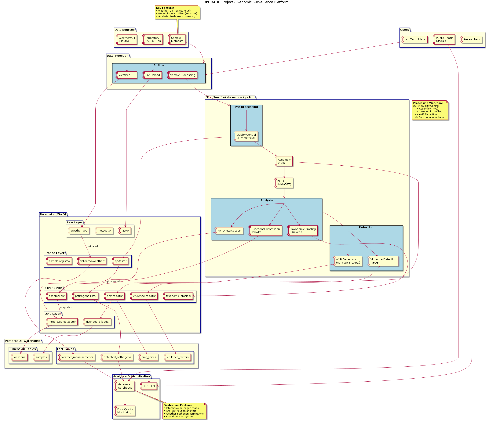

# UPGRADE - Urban Pathogen Genomic Surveillance Network

## Project Overview

The UPGRADE project establishes a dynamic Romanian-Moldovan research collaboration focused on rapid pathogen identification and real-time genomic surveillance in complex urban environments. This project integrates expertise across data generation and bioinformatics analysis to monitor antimicrobial resistance (AMR) genes and pathogens from diverse environmental sources.

## Grant Information

- **Project Title:** Metagenomics and Bioinformatics tools for environmental genomic surveillance of pathogens and antimicrobial resistance genes in public spaces
- **Duration:** 24 months
- **Coordinator:** "Ștefan cel Mare" University of Suceava (USV), Romania
- **Partner:** Technical University of Moldova (TUM)
- **Funding Program:** Romanian-Moldovan bilateral research collaboration

## Research Objectives

### Primary Scope
Foster a dynamic Romanian-Moldovan research collaboration focusing on rapid pathogen identification and real-time genomic surveillance in complex urban environments.

### Specific Aims

**Aim 1:** Sample collection and creating a comprehensive approach to streamline laboratory methods for complex environmental surveillance
- Systematic sample collection from university campuses
- Environmental metadata collection (temperature, humidity, coordinates, timing)
- Streamlined laboratory workflows using Oxford Nanopore Technology (ONT)

**Aim 2:** Development of a scalable and modular bioinformatics framework for high-throughput environmental genomic surveillance
- Quality control and assembly pipelines
- Pathogen detection and antimicrobial resistance gene (ARG) identification
- Integration with environmental metadata

**Aim 3:** Establish a regional community-oriented platform for environmental genomic surveillance of pathogens
- UP-GEN (Urban Pathogen Genomic Surveillance Network) platform
- Interactive tools for data exploration and visualization
- Community engagement and public health integration

## Technical Architecture



*System architecture showing data flows from weather APIs and genomic files through the bioinformatics pipeline to analytics dashboards.*

### Technology Stack (TBA)

## Pipeline Workflow

### **Stage 1: Quality Control & Preprocessing**

**NanoPlot** - Quality Control & Visualization  
Generate comprehensive quality reports including read length distributions, quality scores, and base composition analysis for Oxford Nanopore sequencing data.

**Filtlong** - Read Filtering  
Filter low-quality reads based on length and quality thresholds while maintaining optimal coverage for downstream analysis.

### **Stage 2: Assembly & Polishing**

**Flye** - Metagenomic Assembly  
Perform de novo metagenomic assembly optimized for mixed microbial communities using long-read sequencing data with iterative error correction.

**Medaka** - Consensus Polishing  
Improve assembly accuracy through neural network-based consensus polishing specifically designed for Oxford Nanopore data.

**QUAST** - Assembly Quality Assessment  
Evaluate assembly quality metrics including N50 statistics, contig distributions, and completeness assessments.

### **Stage 3: Binning & Validation**

**MetaBAT2/CONCOCT** - Genome Binning  
Separate metagenomic assemblies into individual genome bins using coverage depth and tetranucleotide frequency patterns.

**CheckM** - Bin Quality Control  
Assess genome bin completeness and contamination levels using lineage-specific marker genes to ensure high-quality bins for downstream analysis.

### **Stage 4: Taxonomic Profiling**

**Kraken2** - Taxonomic Classification  
Perform rapid taxonomic profiling using k-mer matching against comprehensive databases for pathogen identification and abundance estimation.

**Sourmash** - K-mer Classification  
Conduct scalable k-mer-based similarity searches using MinHash sketching for strain-level taxonomic resolution and comparative genomics.

### **Stage 5: Antimicrobial Resistance Detection**

**Abricate + CARD** - AMR Gene Detection  
Identify antimicrobial resistance genes using the Comprehensive Antibiotic Resistance Database (CARD) with configurable identity and coverage thresholds.

**DeepARG** - Machine Learning AMR Prediction  
Apply deep learning algorithms for enhanced antimicrobial resistance gene prediction, including novel and divergent resistance mechanisms.

### **Stage 6: Functional Analysis**

**Prokka** - Functional Annotation  
Perform comprehensive functional annotation of assembled genomes including gene prediction, protein coding sequences, and functional classification.

**Nucmer** - Horizontal Gene Transfer Analysis  
Analyze potential horizontal gene transfer events by identifying shared genomic regions between different microbial populations with high sequence similarity.

### **Stage 7: Statistical Analysis**

**Assembly Statistics** - Quality Metrics  
Calculate comprehensive assembly statistics including N50, coverage depth, contig counts, and genome completeness metrics.

**Bayesian Modeling (brms)** - Environmental Integration  
Implement Bayesian regression models to assess relationships between environmental metadata (temperature, humidity, location) and microbial community composition, pathogen prevalence, and antimicrobial resistance gene abundance.


## Repository Structure

```
upgrade/
├── airflow/                      # Workflow orchestration
│   ├── dags/                     # Pipeline definitions
│   ├── plugins/                  # Custom operators
│   └── config/                   # Configuration files
├── nextflow/                     # Bioinformatics pipelines
│   ├── main.nf                   # Main pipeline
│   ├── modules/                  # Pipeline modules
│   └── nextflow.config           # Pipeline configuration
├── streamlit/                    # Web dashboard
│   └── app.py                    # Main application
├── kafka/                        # Data streaming
│   ├── producer/                 # Weather data producer
│   └── consumer/                 # Data consumer
├── database/
│   └── migrations/               # Database schema
├── docs/                         # Project documentation
├── sandbox/                      # Development experiments
└── web-dashboard/                # React frontend
    ├── backend/                  # API backend
    └── frontend/                 # React components
```

## Development Status

This project is currently in active development. The infrastructure includes:

- **Containerized Environment:** Docker Compose setup with PostgreSQL, MinIO, Redis, Airflow, Kafka
- **Weather Data Pipeline:** Real-time weather data collection and storage
- **Genomic Processing:** Nextflow pipeline with quality control modules
- **Web Interface:** Streamlit dashboard for data visualization

## Team

### Romania (USV)
- **Project Director:** Dr. Roxana Filip - Microbiology and bacterial resistance mechanisms
- **Senior Researcher:** Prof. Mihai Dimian - Mathematical models and biostatistics
- **Postdoc Researcher:** Dr. Liliana Anchidin-Norocel - Metagenomics expertise

### Moldova (TUM)
- **Co-Director:** Dr. Inna Rastimesina - Environmental microbiology and biotechnology
- **Senior Researcher:** Dr. Dumitru Ciorbă - Computational biology and bioinformatics
- **PhD Student:** Viorel Munteanu - Bioinformatics and data analysis
- **PhD Student:** Eugeniu Catlabuga - Software engineering and platform development

## Publications and Dissemination

### Planned Publications
- Two high-impact Q1/Q2 journal publications
- Conference presentations at RoBioinfo, ECCO2026, ESCMID

### Platform Deployment
- UP-GEN platform development
- Integration with ELIXIR platform
- Community engagement activities

## Contact Information

**Project Coordinator:** Dr. Roxana Filip  
Email: roxana.filip@usv.ro  
Institution: "Ștefan cel Mare" University of Suceava, Romania

**Technical Lead:** Viorel Munteanu  
Email: viorel.munteanu@utm.md  
Institution: Technical University of Moldova

## License

This project is licensed under the MIT License - see the [LICENSE](LICENSE) file for details.

## Acknowledgments

This work is supported by the Romanian-Moldovan bilateral research collaboration grant program. We acknowledge the contributions of all team members and the support from both participating institutions.