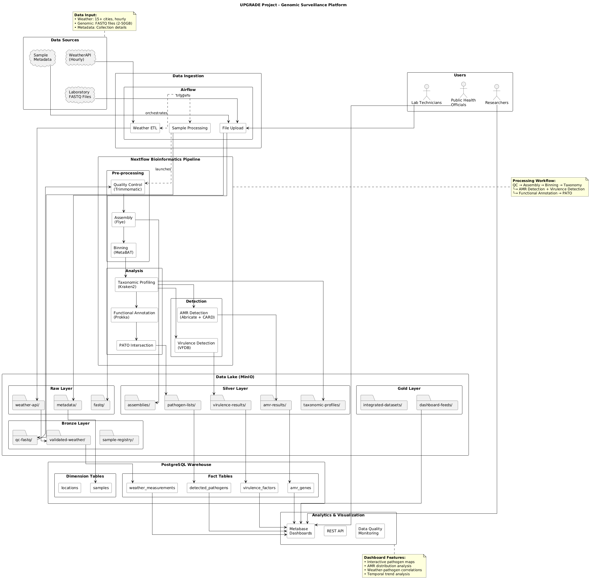

# UPGRADE - Urban Pathogen Genomic Surveillance Network

## Project Overview

The UPGRADE project establishes a dynamic Romanian-Moldovan research collaboration focused on rapid pathogen identification and real-time genomic surveillance in complex urban environments. This project integrates expertise across data generation and bioinformatics analysis to monitor antimicrobial resistance (AMR) genes and pathogens from diverse environmental sources.

## Grant Information

- **Project Title:** Metagenomics and Bioinformatics tools for environmental genomic surveillance of pathogens and antimicrobial resistance genes in public spaces
- **Duration:** 24 months
- **Coordinator:** "Ștefan cel Mare" University of Suceava (USV), Romania
- **Partner:** Technical University of Moldova (TUM)
- **Funding Program:** Romanian-Moldovan bilateral research collaboration

## Research Objectives

### Primary Scope
Foster a dynamic Romanian-Moldovan research collaboration focusing on rapid pathogen identification and real-time genomic surveillance in complex urban environments.

### Specific Aims

**Aim 1:** Sample collection and creating a comprehensive approach to streamline laboratory methods for complex environmental surveillance
- Systematic sample collection from university campuses
- Environmental metadata collection (temperature, humidity, coordinates, timing)
- Streamlined laboratory workflows using Oxford Nanopore Technology (ONT)

**Aim 2:** Development of a scalable and modular bioinformatics framework for high-throughput environmental genomic surveillance
- Quality control and assembly pipelines
- Pathogen detection and antimicrobial resistance gene (ARG) identification
- Integration with environmental metadata

**Aim 3:** Establish a regional community-oriented platform for environmental genomic surveillance of pathogens
- UP-GEN (Urban Pathogen Genomic Surveillance Network) platform
- Interactive tools for data exploration and visualization
- Community engagement and public health integration

## Technical Architecture



*Figure 1: Complete system architecture showing data flows from weather APIs and FASTQ files through the bioinformatics pipeline to analytics dashboards.*

### Data Pipeline
```
<!-- Weather API → MinIO (Raw) → Nextflow Pipeline → PostgreSQL → Metabase Dashboard -->
FASTQ Files → QC → Assembly → AMR Detection → Results Storage → Visualization
```

### Technology Stack
- **Data Storage:** PostgreSQL, MinIO Object Storage
- **Pipeline Orchestration:** Apache Airflow, Nextflow
- **Bioinformatics Tools:** Flye, Kraken2, Abricate, CARD database
- **Visualization:** Metabase dashboards
- **Infrastructure:** Docker, Kubernetes

### Bioinformatics Workflow
1. **Quality Control** - Trimmomatic, NanoPlot, Filtlong
2. **Assembly** - Flye for long-read metagenomic assembly
3. **Taxonomic Classification** - Kraken2, Sourmash
4. **Functional Annotation** - Prokka
5. **AMR Detection** - Abricate against CARD database
6. **Pathogen Identification** - PATO intersection analysis

## Data Management

### Data Lake Structure (MinIO)
- **Raw Layer:** FASTQ files, weather API responses, sample metadata
- **Bronze Layer:** Validated and cleaned data
- **Silver Layer:** Processed assemblies, taxonomic profiles, AMR results
- **Gold Layer:** Integrated datasets, research exports, dashboard feeds

### Database Schema (PostgreSQL)
- **dim_locations:** Sampling locations with geographic coordinates
- **dim_samples:** Sample registry with collection metadata
- **fact_weather_measurements:** Hourly weather data from multiple points
- **detected_pathogens:** Identified pathogens with abundance data
- **amr_genes:** Antimicrobial resistance genes and profiles
- **virulence_factors:** Virulence factors and associated pathogens

<!-- ## Installation and Setup

### Prerequisites
- Docker and Docker Compose
- Kubernetes cluster (for production)
- WeatherAPI key
- MinIO storage setup -->

<!-- ### Repository Structure
```
upgrade/
├── docs/
│   ├── architecture-diagram.puml     # PlantUML source file
│   ├── architecture-diagram.png      # Generated diagram
│   └── api-documentation.md
├── src/
│   ├── airflow/dags/                 # ETL pipelines
│   ├── nextflow/                     # Bioinformatics workflows
│   └── api/                          # REST API endpoints
├── infrastructure/
│   ├── docker-compose.yml
│   ├── kubernetes/
│   └── helm-charts/
├── sql/
│   ├── schema/                       # Database schemas
│   └── migrations/                   # Database migrations
└── README.md
``` -->

### Development Environment
```bash
git clone https://github.com/nicolaedrabcinski/upgrade.git
cd upgrade
docker-compose up -d
```

<!-- ### Generating Architecture Diagram
```bash
# Install PlantUML
npm install -g plantuml

# Generate diagram from source
plantuml docs/architecture-diagram.puml -o docs/
```
```bash
helm install upgrade ./kubernetes/helm-charts/upgrade
kubectl apply -f kubernetes/manifests/
``` -->

<!-- ## Usage

### Dashboard Access
- **Public Dashboard:** http://your-domain.com/dashboard
- **Research Interface:** http://your-domain.com/research
- **API Documentation:** http://your-domain.com/api/docs

### Data Upload
1. Upload FASTQ files via web interface
2. Complete sample metadata forms
3. Monitor processing status in dashboard
4. Access results through interactive visualizations -->

## Team

### Romania (USV)
- **Project Director:** Dr. Roxana Filip - Microbiology and bacterial resistance mechanisms
- **Senior Researcher:** Prof. Mihai Dimian - Mathematical models and biostatistics
- **Postdoc Researcher:** Dr. Liliana Anchidin-Norocel - Metagenomics expertise

### Moldova (TUM)
- **Co-Director:** Dr. Inna Rastimesina - Environmental microbiology and biotechnology
- **Senior Researcher:** Dr. Dumitru Ciorbă - Computational biology and bioinformatics
- **PhD Student:** Viorel Munteanu - Bioinformatics and data analysis
- **PhD Student:** Eugeniu Catlabuga - Software engineering and platform development

## Publications and Dissemination

### Planned Publications
- [ ] Two high-impact Q1/Q2 journal publications
- [ ] Conference presentations at RoBioinfo, ECCO2026, ESCMID

### Platform Deployment
- [ ] UP-GEN platform deployment
- [ ] Integration with ELIXIR platform
- [ ] Community engagement activities

## Funding Opportunities

### Target Programs
- **Horizon Europe:** Large scale research projects on public health and pathogen monitoring
- **European Innovation Council (EIC):** Breakthrough technologies in real-time genomics
- **JPIAMR:** Joint Programming Initiative on Antimicrobial Resistance

---

## TODO Checklist

### Phase 1: Infrastructure Setup
- [ ] **Database Setup**
  - [ ] PostgreSQL with PostGIS extension
  - [ ] TimescaleDB for time-series data
  - [ ] Schema creation and indexes
  - [ ] User roles and permissions
- [ ] **MinIO Object Storage**
  - [ ] MinIO cluster deployment
  - [ ] Bucket structure creation (raw/bronze/silver/gold)
  - [ ] Access policies configuration
  - [ ] Backup and retention policies
- [ ] **Docker Environment**
  - [ ] Docker Compose for development
  - [ ] Container orchestration setup
  - [ ] Environment variables management

### Phase 2: Data Ingestion
- [ ] **Weather Data Pipeline**
  - [ ] WeatherAPI integration
  - [ ] Airflow DAG for weather collection
  - [ ] Data validation and cleaning
  - [ ] Hourly scheduling configuration
  - [ ] Error handling and retry logic
- [ ] **Sample Upload System**
  - [ ] File upload interface
  - [ ] Metadata collection forms
  - [ ] FASTQ file validation
  - [ ] Storage integration with MinIO

### Phase 3: Bioinformatics Pipeline
- [ ] **Nextflow Setup**
  - [ ] Nextflow installation and configuration
  - [ ] Container registry for bioinformatics tools
  - [ ] Pipeline execution environment
- [ ] **Quality Control Module**
  - [ ] Trimmomatic integration
  - [ ] NanoPlot quality assessment
  - [ ] Filtlong for read filtering
  - [ ] Quality metrics reporting
- [ ] **Assembly Pipeline**
  - [ ] Flye assembler setup
  - [ ] Assembly quality control
  - [ ] Contig processing and validation
- [ ] **Taxonomic Classification**
  - [ ] Kraken2 database setup
  - [ ] Taxonomic profiling pipeline
  - [ ] Species abundance calculation
- [ ] **AMR Detection**
  - [ ] Abricate tool integration
  - [ ] CARD database installation
  - [ ] AMR gene identification pipeline
  - [ ] Resistance profile generation
- [ ] **Pathogen Analysis**
  - [ ] PATO intersection implementation
  - [ ] Virulence factor detection (VFDB)
  - [ ] Pathogen-AMR correlation analysis

### Phase 4: Analytics and Visualization
- [ ] **Metabase Setup**
  - [ ] Metabase installation and configuration
  - [ ] Database connections setup
  - [ ] User roles and permissions
  - [ ] Embedding configuration
- [ ] **Dashboard Development**
  - [ ] Interactive maps for pathogen distribution
  - [ ] Weather correlation visualizations
  - [ ] AMR gene tracking dashboards
  - [ ] Time series analysis views
  - [ ] Data quality monitoring dashboards
- [ ] **API Development**
  - [ ] REST API endpoints
  - [ ] Authentication and authorization
  - [ ] API documentation (OpenAPI/Swagger)
  - [ ] Rate limiting and security

### Phase 5: Integration and Testing
- [ ] **Data Integration**
  - [ ] Weather-genomic data correlation
  - [ ] Batch processing workflows
  - [ ] Data pipeline orchestration
  - [ ] Quality assurance procedures
- [ ] **System Testing**
  - [ ] Unit tests for pipeline components
  - [ ] Integration testing
  - [ ] Performance testing
  - [ ] User acceptance testing
- [ ] **Documentation**
  - [ ] User manual creation
  - [ ] API documentation
  - [ ] Deployment guides
  - [ ] Troubleshooting documentation

### Phase 6: Deployment and Operations
- [ ] **Production Deployment**
  - [ ] Kubernetes cluster setup
  - [ ] Helm charts creation
  - [ ] CI/CD pipeline configuration
  - [ ] SSL certificates and domain setup
- [ ] **Monitoring and Alerting**
  - [ ] Prometheus metrics collection
  - [ ] Grafana dashboards
  - [ ] Log aggregation (ELK stack)
  - [ ] Alert configuration
- [ ] **Security Implementation**
  - [ ] Security audit and penetration testing
  - [ ] Data encryption at rest and in transit
  - [ ] GDPR compliance measures
  - [ ] Backup and disaster recovery

### Phase 7: Dissemination and Community
- [ ] **Scientific Publications**
  - [ ] Manuscript 1: Methodological framework
  - [ ] Manuscript 2: Regional surveillance findings
  - [ ] Conference abstracts and presentations
- [ ] **Platform Launch**
  - [ ] UP-GEN platform public launch
  - [ ] User training and documentation
  - [ ] Community engagement activities
  - [ ] Stakeholder presentations
- [ ] **Future Funding**
  - [ ] EU Horizon Europe proposal preparation
  - [ ] EIC application development
  - [ ] JPIAMR collaboration proposals

## Progress Tracking

### Completed Tasks
- [x] Project architecture design
- [x] Grant documentation review
- [x] Team coordination established
- [x] Technology stack selection
- [x] Repository setup and initial codebase

### Current Sprint
- [ ] Database schema implementation
- [ ] MinIO storage configuration
- [ ] Weather data ETL pipeline development

### Upcoming Milestones
- **Month 3:** MVP dashboard with weather data
- **Month 6:** Nextflow pipeline integration
- **Month 12:** Full platform beta release
- **Month 18:** Scientific publications submission
- **Month 24:** Final platform deployment and community launch

## Contact Information

**Project Coordinator:** Dr. Roxana Filip  
Email: roxana.filip@usv.ro  
Institution: "Ștefan cel Mare" University of Suceava, Romania

**Technical Lead:** Viorel Munteanu  
Email: viorel.munteanu@utm.md  
Institution: Technical University of Moldova

## License

This project is licensed under the MIT License - see the [LICENSE](LICENSE) file for details.

## Acknowledgments

This work is supported by the Romanian-Moldovan bilateral research collaboration grant program. We acknowledge the contributions of all team members and the support from both participating institutions.

## TODOs

[TODO.md](TODO)